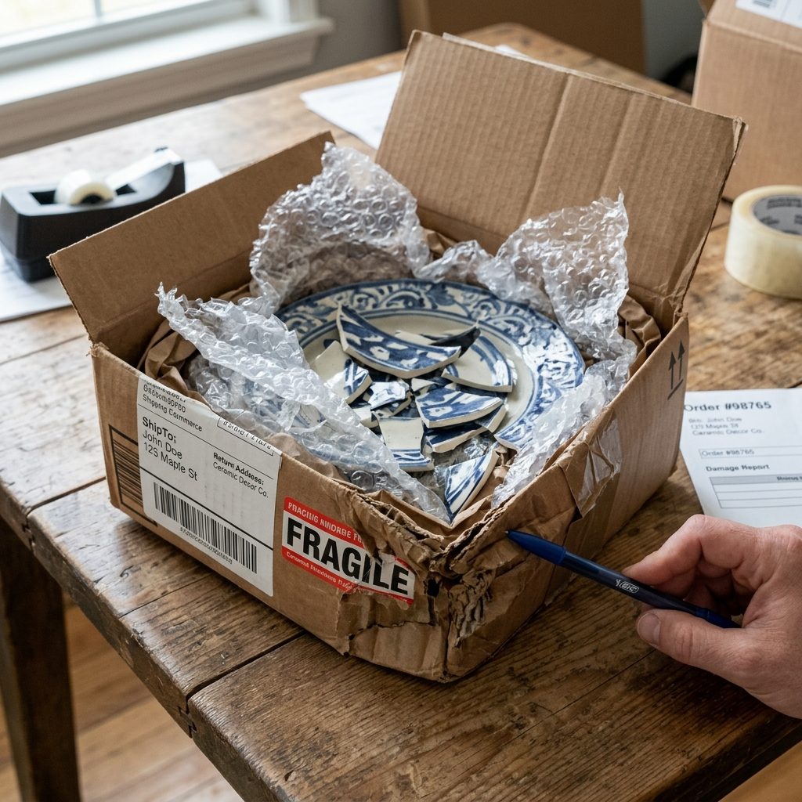

# E-Commerce Customer Support AI Voice Agent

A voice-first and vision-enabled e-commerce customer support desk powered by **Gemini 3.8 Live**. Built for modern online retail, the agent handles real-time delivery tracking, transit milestone inquiries, 30-day return and exchange requests, order cancellations, address updates, damaged product inspections via webcam, missing item claims, and supervisor escalations—executing business actions in the background while keeping up natural, low-latency spoken conversation.



---

## What Gemini 3.8 Live Makes Possible

Real-time audio, live video camera frames, and non-blocking background tool executions within a single streaming session:

- **Voice-to-Voice Interaction**: Ultra-low latency spoken conversation with live transcription, allowing customers to talk naturally without robotic pauses.
- **Vision-Powered Damage Inspection**: Customers reporting shattered or defective items can tap **Show Camera** and hold up the product. The agent inspects the camera stream, detects physical cracks or crushed corners, calls `pin_damaged_item_photo`, and tapes the frame into the evidence board.
- **Automated Business Rules & Non-Blocking Actions**: While the agent talks, background tools verify customer CRM profiles, calculate remaining return window days, authorize pre-paid return labels, cancel unshipped orders, or dispatch free replacements.
- **Full Fallback Capabilities**: If a microphone or camera is unavailable, customers can type directly into the chat box or use 1-click test scenario chips.

---

## Core Capabilities

### 1. Delivery Status & Transit Tracking
- Live status tracking across all order stages: `processing`, `shipped`, `in_transit`, `out_for_delivery`, `delivered`, `delayed`.
- Real-time carrier milestone stepper (FedEx, UPS, DHL, USPS) with timestamps, sorting facilities, and courier notes (e.g. "Out for delivery with driver Carlos, 3 stops away").

### 2. Returns & Exchanges
- Deterministic 30-day return window calculation.
- Automated generation of pre-paid FedEx/UPS return labels and QR drop-off codes.
- Customer choice between original payment refund or instant store credit with a **+10% loyalty bonus**.
- 1-click size/color replacement flow.

### 3. Damaged Goods & Complaint Resolution
- Live webcam inspection of damaged goods and crushed shipping boxes.
- Damaged items under $150 qualify for **instant free replacement or full refund without requiring return of hazardous broken items** (e.g., shattered ceramic dinnerware).
- Expedited reshipment for items missing from delivered packages.
- Proactive courtesy store credits for severe transit weather delays.

### 4. Pre-Delivery & Post-Return Window Handling
- **Pre-Delivery (Processing)**: Instant order cancellation with 100% immediate refund, or instant shipping address update before fulfillment.
- **Post-Return Window (>30 Days)**: Polite policy explanation, referral to the manufacturer's 1-year limited warranty, and VIP courtesy store-credit options.

---

## App Engine Architecture

| Layer | Engine / Model | Purpose |
| --- | --- | --- |
| **Live Voice & Vision** | `gemini-live-2.5-flash-native-audio` (Vertex) / `gemini-3.8-live` (Studio) | Full-duplex speech, webcam vision inspection, transcription |
| **Extraction & Graph** | `gemini-2.5-flash` / Google ADK | Normalizes customer speech, extracts order facts, classifies intent |
| **Background Tools** | `live_demo/live_tools.py` | Declares 5 non-blocking tools (`lookup_customer`, `lookup_order`, `sync_support_ticket`, `pin_damaged_item_photo`, `process_order_action`) |
| **Order Directory & CRM** | `order_directory.py` | In-memory mock database of 5 customers and 11 orders across all lifecycle states |
| **Business Rules & Gates** | `policies.py` + Pydantic | Deterministic return window validation, cancellation eligibility, and CRM ticket markdown builder |
| **App Backend** | FastAPI + WebSockets (`server.py`) | Manages audio/video WebSocket transport, tool executions, and REST APIs on port `4188` |
| **Frontend UI** | HTML5, Vanilla CSS, Modern ES6 (`app.js`) | Sleek dark e-commerce dashboard, milestone stepper, audio visualizer, evidence board, and CRM ticket handoff |

---

## Demo Test Customers & Orders

Say or type these names or order numbers on the live call, or switch between them with one click in the top navigation bar:

| Customer | Loyalty Tier | Order # | Status | Scenario / Query |
| --- | --- | --- | --- | --- |
| **Sarah Jenkins** | Gold VIP | `ORD-94301` | **Out for Delivery** | Coffee & Espresso Maker arriving today by 2:30 PM (3 stops away). |
| **Sarah Jenkins** | Gold VIP | `ORD-88219` | **Delivered** (3 days ago) | AuraWave ANC Headphones ($299.99). **Eligible for return** (27 days left). |
| **Sarah Jenkins** | Gold VIP | `ORD-71042` | **Delivered** (65 days ago) | RoboClean Vacuum ($499.00). **Return window expired**; under 1-yr warranty. |
| **Marcus Vance** | Standard | `ORD-62184` | **Delivered** (yesterday) | Stoneware Dinnerware ($118.00). **Shattered plates in box; camera inspection!** |
| **Marcus Vance** | Standard | `ORD-51920` | **In Transit** | Down Parka ($220.00). **Weather delay** in Chicago; $15 courtesy credit. |
| **Elena Rostova** | Silver | `ORD-33018` | **Processing** | ErgoFlex Desk Chair ($349.00). **Cancellable before shipping** or address update. |
| **Elena Rostova** | Silver | `ORD-21980` | **Delivered** (12 days ago) | Running Shoes ($140.00). Customer requests size exchange (9 to 9.5). |
| **David Kim** | Platinum | `ORD-44912` | **Delivered** (2h ago) | 4K Studio Display ($549.99). **Package missing from porch**; tracer ticket. |
| **David Kim** | Platinum | `ORD-10499` | **Processing** | Mechanical Keyboard ($189.00). Cancellable or tracking check. |
| **Aisha Patel** | Standard | `ORD-77621` | **Delivered** (5 days ago) | Apparel Order. **Cashmere sweater missing from delivered box**; reshipment. |
| **Aisha Patel** | Standard | `ORD-80312` | **Shipped** | Smart Home Bridge ($129.99). In transit, arriving tomorrow. |

---

## Project Structure

```text
customer-support-agent/
├── README.md                      # Complete setup, architecture & demo guide
├── requirements.txt               # Standalone Python package dependencies
├── .env.example                   # Environment configuration template
├── .env                           # Local active configuration
├── schemas.py                     # Pydantic data contracts (orders, items, tickets)
├── order_directory.py             # Mock DB with 5 customers & 11 realistic orders
├── policies.py                    # Deterministic business rules & ticket markdown builder
├── agent.py                       # Google ADK workflow graph
├── examples.py                    # Pre-canned test prompts & demo scenarios
├── tests/
│   └── test_support_policies.py   # Unit test suite for business rules
└── live_demo/
    ├── index.html                 # Modern e-commerce support dashboard UI
    ├── styles.css                 # Refined CSS design tokens (dark theme, glassmorphism)
    ├── app.js                     # Web Audio, camera frame grabber, WebSocket client
    ├── live_tools.py              # Gemini 3.8 Live background tools & system instruction
    ├── server.py                  # FastAPI WebSocket & REST server (port 4188)
    └── assets/
        ├── damaged_package_sample.jpg # Sample damaged package evidence asset
        └── package_placeholder.png    # Evidence placeholder
```

---

## Quickstart & Local Setup

### 1. Environment Setup

From the `customer-support-agent` directory:

```bash
cd customer-support-agent
python3.12 -m venv .venv
source .venv/bin/activate
pip install -r requirements.txt
cp .env.example .env
```

### 2. Configure Credentials in `.env`

The project supports both Google Cloud Vertex AI and Google AI Studio:

**Option A: Google Cloud Vertex AI (Default)**
```bash
GOOGLE_GENAI_USE_VERTEXAI=True
GOOGLE_CLOUD_PROJECT=your-gcp-project-id
GOOGLE_CLOUD_LOCATION=us-central1
SUPPORT_MODEL=gemini-2.5-flash
```

**Option B: Google AI Studio**
```bash
GOOGLE_GENAI_USE_VERTEXAI=False
GOOGLE_API_KEY=your-gemini-api-key
SUPPORT_MODEL=gemini-3.8-flash
```

### 3. Run Automated Unit Tests

Verify deterministic business rules and policy evaluations:

```bash
python -m unittest discover -s tests -p "test_*.py"
```

---

## Running the Application

### Start the Backend and Frontend Server

```bash
python -m uvicorn live_demo.server:app --reload --host 127.0.0.1 --port 4188
```

Open your browser at:

```text
http://127.0.0.1:4188/index.html
```

---

## Step-by-Step Demo Guide

Here are ready-to-use spoken or typed prompts to showcase each capability:

### Scenario 1: Delivery Status & Live Courier Tracking
1. Select customer **Sarah Jenkins** in the top bar.
2. Tap **Talk to Assistant** (or click the demo scenario chip) and say:
   > *"Hi, this is Sarah Jenkins. I'm checking on my coffee order ORD-94301. When is it arriving today and where is the courier right now?"*
3. **What happens**: The agent looks up `ORD-94301`, confirms out-for-delivery status with courier Carlos (3 stops away), estimated delivery window between 1:00 PM - 3:00 PM, and the milestone stepper highlights step 4.

### Scenario 2: 30-Day Return & Pre-Paid Label Generation
1. Select order `ORD-88219` (or click *Return Headphones* chip) and say:
   > *"Hi, I received my AuraWave headphones on order ORD-88219 three days ago. They don't fit comfortably, so I'd like to initiate a return."*
2. **What happens**: The agent checks the 30-day return policy (27 days left), verifies the item is returnable, authorizes return `RET-XXXX`, offers instant store credit (+10% bonus) or original payment refund, and generates a pre-paid FedEx return label.

### Scenario 3: Damaged Goods with Live Camera Inspection
1. Select customer **Marcus Vance** and order `ORD-62184`.
2. Tap **Show Camera** (or click the *Damaged Stoneware* chip) and say:
   > *"My ceramic dinnerware set arrived yesterday, but when I opened the box, two of the bowls were shattered. Can I show you on camera to get a replacement?"*
3. Hold up the damaged item or packaging to the camera.
4. **What happens**: The agent inspects the camera stream, detects the broken ceramic pieces, calls `pin_damaged_item_photo`, pins the photo card into the evidence board, and auto-approves an expedited replacement (`REP-XXXX`) without requiring the return of broken glass.

### Scenario 4: Cancelling an Unshipped Processing Order
1. Select customer **Elena Rostova** and order `ORD-33018`.
2. Say or type:
   > *"Hi, Elena Rostova here. I placed order ORD-33018 this morning for an ergonomic desk chair, but I need to cancel it before it ships. Can you help me?"*
3. **What happens**: The agent verifies the order status is `processing`, executes `cancel_order`, confirms the full refund of $349.00 to her corporate card, and the UI status updates to `CANCELLED`.

### Scenario 5: Expired Return Window (>30 Days) & Warranty Guidance
1. Select customer **Sarah Jenkins** and order `ORD-71042`.
2. Say or type:
   > *"Hi, Sarah Jenkins again regarding order ORD-71042. My RoboClean vacuum stopped charging yesterday. I know it's been over two months, but what are my options?"*
3. **What happens**: The agent explains that the 30-day store return window closed in August, but notes her vacuum is covered under the 1-year manufacturer warranty and offers manufacturer claim details.

### Scenario 6: Exporting the CRM Support Ticket
1. At any point during or after a conversation, click **📋 CRM Ticket** in the top navbar.
2. A modal dialog opens showing the complete Markdown handoff ticket containing order details, carrier tracking, policy checks, camera inspection logs, and executed actions.
3. Click **Copy Markdown** to paste into Zendesk, Salesforce Service Cloud, or Jira.

---

## License

MIT License. Designed and built with Google Gemini 3.8 Live and Google ADK.
